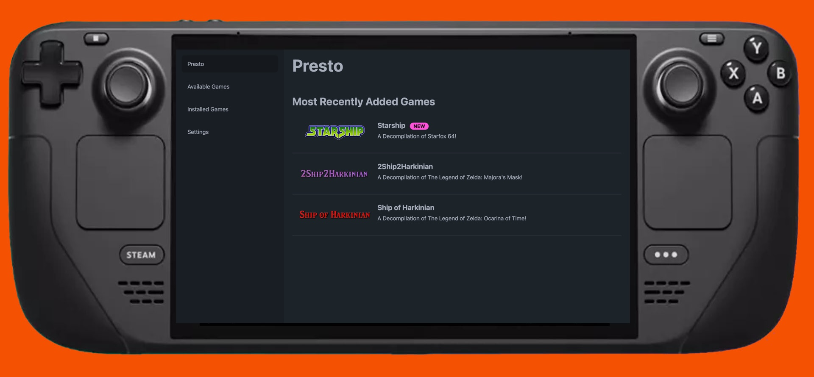

# Presto   
## An easy-to-use game installer

The purpose of this project is to make it easier to install and launch open-source and decompilation/recompilation games.

### `WARNING: This is currently highly experimental and could change/break`

#### Why yet another game installer?

I know Lutris and Heroic Game Installer are out there, but they require more of the user and Lutris' installers are hit and miss.

These decomp/recomp projects are awesome, but I wanted to have something easy to use for my steamdeck on the go to make this work. 

Lastly - I've wanted to play with Tauri and Rust for a while now... and I haven't built naything with Sstro that's been 'shippable'... so this allowed me to try out some stuff I've wanted to experiment with.

#### Project Goal:
- Provide a one-stop-shop for installing and launching decompilation/recompilation games with a configurable schema for adding more games with a focus on Steam Deck compatibility

#### Currently working:
- Can show a list of games
- Can download, unzip, install, uninstall, and launch a game
- Will let you setup a configuration directory
- Will install a game's data files
- Will keep track of installed games
- Gamepad support for navigating the UI

#### Immediate TODOs:
- Need to setup auto-update for Presto
- Add flatpak support
- Add a way for games to check for updates and install them
- Would like to find a way to auto-add games to Steam

#### Future Goals:
- Better filtering/sorting options
- Add more games, look into adding open source ports of games
- Look into a companion server app, so if you have gog games, repacks, isos, ect... you could have a way to remotely catalog and install them

NOTE:
- This project is UNAFFILIATED with Steam, Valve, or any other game company.
- This project is UNAFFILIATED with any of the developers of these projects.
- This project is for PERSONAL USE ONLY.

Credit to :
- https://github.com/manuelernestog/astrofy for the theme!
- https://github.com/alvaromontoro/gamecontroller.js for the game controller library!
